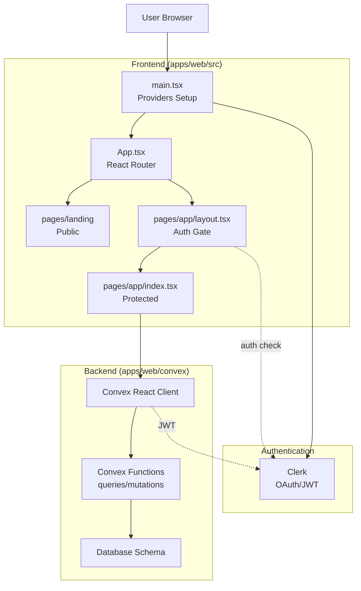

# AGENTS.md
This file provides guidance to Verdent when working with code in this repository.

## Table of Contents
1. Commonly Used Commands
2. High-Level Architecture & Structure
3. Key Rules & Constraints
4. Development Hints

## Commands

**Development (from root):**
```bash
bun dev          # Start Vite dev server for apps/web
bun build        # TypeScript compile + Vite production build
```

**Development (from apps/web):**
```bash
bun dev          # Start Vite dev server with HMR
bun build        # TypeScript compile + Vite production build
bun lint         # Run ESLint (flat config, no type-aware rules yet)
bun preview      # Preview production build locally
```

**Convex Backend:**
```bash
bunx convex dev   # Start Convex dev mode (watch functions, sync schema)
bunx convex deploy # Deploy Convex functions to production
bunx convex docs  # Open Convex documentation
```

**Shadcn/ui Components:**
```bash
bunx shadcn@latest add <component-name>  # Add shadcn/ui component
```

**Testing:**
- No test framework configured yet [inferred]

## Architecture

### Overview
**Finta** is a personal finance application built as a Bun monorepo with a single web app using modern React, serverless Convex backend, and Clerk authentication.

### Subsystem Responsibilities

1. **Frontend (`apps/web/src/`)**
   - React 19 + TypeScript + Vite
   - Routing: React Router v7 (`/` → landing, `/app` → dashboard)
   - UI: Tailwind CSS 4 + shadcn/ui (new-york style)
   - PWA: Service worker with offline support (start_url: `/app`)

2. **Backend (`apps/web/convex/`)**
   - Convex serverless functions (queries, mutations, actions)
   - Real-time database with type-safe schema
   - Auth integration via Clerk JWT (`CLERK_JWT_ISSUER_DOMAIN`)

3. **Authentication**
   - Clerk handles OAuth, user management, JWT tokens
   - Integration: `ClerkProvider` → `ConvexProviderWithClerk` → `useAuth`
   - Protected routes use `<Authenticated>`, `<Unauthenticated>`, `<AuthLoading>` from `convex/react`

### Data Flow

```
User Request
    ↓
[Landing Page] → [Clerk Sign-In] → [Dashboard (/app)]
    ↓                                    ↓
[Public Route]              [Protected: <Authenticated>]
                                         ↓
                           [React Component uses useQuery/useMutation]
                                         ↓
                           [Convex Client (authenticated with Clerk JWT)]
                                         ↓
                           [Convex Function (query/mutation/action)]
                                         ↓
                           [Convex Database (real-time sync)]
```

### External Dependencies

- **Clerk** (auth): `VITE_CLERK_PUBLISHABLE_KEY` required
- **Convex** (backend): `VITE_CONVEX_URL` required, `CLERK_JWT_ISSUER_DOMAIN` set in Convex dashboard
- **Bun** runtime: Node v20 (`.nvmrc`) for compatibility, but Bun preferred for package management

### Development Entry Points

- **Frontend**: `apps/web/src/main.tsx` (app bootstrap)
- **Routing**: `apps/web/src/App.tsx` (route definitions)
- **Backend**: `apps/web/convex/` (add `.ts` files for queries/mutations)
- **Database Schema**: `apps/web/convex/schema.ts` (currently empty)
- **Styles**: `apps/web/src/index.css` (Tailwind + custom CSS)

### Subsystem Diagram



## Key Rules & Constraints

### From .cursor/rules/
- **Package Manager**: Use Bun instead of npm/pnpm/yarn for all package operations [inferred from symlink `use-bun-instead-of-node-vite-npm-pnpm.mdc`]

### TypeScript Configuration
- **Strict Mode Enabled**: All strict TypeScript checks are on (`strict: true`)
- **Unused Detection**: `noUnusedLocals`, `noUnusedParameters` enforced
- **Path Aliases**: Use `@/*` for `src/*` imports (configured in both Vite and TypeScript)
- **Target**: ES2022 (modern syntax allowed)

### ESLint Configuration
- **Flat Config**: ESLint v9+ with `defineConfig` pattern
- **Rules Active**:
  - TypeScript recommended rules
  - React Hooks rules (exhaustive deps, etc.)
  - React Refresh rules (fast refresh compatibility)
- **Type-Aware Rules**: NOT enabled (can be added per `README.md` if needed)

### Convex Backend
- **Schema Changes**: Must run `npx convex dev` or `npx convex deploy` after editing `schema.ts`
- **Function Pattern**:
  - Queries: Read-only, cached, real-time
  - Mutations: Write operations, transactional
  - Actions: External API calls, non-transactional
- **Auth Context**: Available via `ctx.auth.getUserIdentity()` in authenticated functions

### Environment Variables
- **Required**:
  - `VITE_CLERK_PUBLISHABLE_KEY` (frontend, Clerk initialization)
  - `VITE_CONVEX_URL` (frontend, Convex connection)
  - `CLERK_JWT_ISSUER_DOMAIN` (Convex dashboard, not local `.env`)
- **Validation**: Both Vite env vars throw errors if missing (`main.tsx`)

### Monorepo Structure
- **Workspaces**: `["apps/*", "packages/*"]` configured, but `packages/` doesn't exist yet
- **Filtering**: Use `bun run --filter web <script>` to target `apps/web` from root

### Shadcn/ui Components
- **Style**: `new-york` (denser, more refined)
- **Config**: `components.json` with path aliases
- **Base Color**: `neutral`
- **Installation**: Use `npx shadcn@latest add <component>` (not `bunx`)

## Development Hints

### Adding a New Convex Query/Mutation

1. Create file in `apps/web/convex/` (e.g., `transactions.ts`)
2. Define schema in `convex/schema.ts`:
   ```typescript
   import { defineSchema, defineTable } from "convex/server";
   import { v } from "convex/values";
   
   export default defineSchema({
     transactions: defineTable({
       amount: v.number(),
       description: v.string(),
       userId: v.string(),
     }).index("by_user", ["userId"]),
   });
   ```
3. Write function:
   ```typescript
   import { query, mutation } from "./_generated/server";
   import { v } from "convex/values";
   
   export const list = query({
     args: {},
     handler: async (ctx) => {
       const identity = await ctx.auth.getUserIdentity();
       if (!identity) throw new Error("Not authenticated");
       return await ctx.db
         .query("transactions")
         .withIndex("by_user", (q) => q.eq("userId", identity.subject))
         .collect();
     },
   });
   ```
4. Use in React component:
   ```typescript
   import { useQuery } from "convex/react";
   import { api } from "../convex/_generated/api";
   
   const transactions = useQuery(api.transactions.list);
   ```

### Adding a New Protected Route

1. Create component in `apps/web/src/pages/app/` (e.g., `transactions.tsx`)
2. Add route in `App.tsx`:
   ```typescript
   <Route path="/app" element={<AppLayout />}>
     <Route index element={<AppDashboard />} />
     <Route path="transactions" element={<Transactions />} />
   </Route>
   ```
3. Auth is already handled by `AppLayout` (no additional guards needed)

### Adding a Shadcn/ui Component

```bash
npx shadcn@latest add button
# Creates apps/web/src/components/ui/button.tsx
# Updates components.json registry
```

Usage:
```typescript
import { Button } from "@/components/ui/button";

<Button variant="default">Click me</Button>
```

### Environment Setup for New Developer

1. Install Bun: `curl -fsSL https://bun.sh/install | bash`
2. Copy env vars: `cp apps/web/env.example apps/web/.env`
3. Set up Clerk account, copy publishable key to `.env`
4. Set up Convex project:
   ```bash
   cd apps/web
   npx convex dev  # Follow prompts to create/link project
   ```
5. Configure Clerk in Convex dashboard (JWT issuer domain)
6. Install dependencies: `bun install` (root)
7. Start dev: `bun dev` (root) + `npx convex dev` (separate terminal in `apps/web`)

### Debugging Auth Issues

- **"Not authenticated" errors**: Check Clerk `VITE_CLERK_PUBLISHABLE_KEY` and Convex `CLERK_JWT_ISSUER_DOMAIN` match
- **Redirect loops**: Ensure `<Authenticated>` and `<Unauthenticated>` components wrap routes correctly
- **Missing user identity**: Verify `await ctx.auth.getUserIdentity()` in Convex functions returns non-null

### PWA Development

- **Icons**: Place `icon-192.png` and `icon-512.png` in `apps/web/public/icons/`
- **Manifest**: Configured in `vite.config.ts` (start_url: `/app`)
- **Service Worker**: Auto-generated by `vite-plugin-pwa` with `registerType: 'autoUpdate'`
- **Testing**: Run `bun build && bun preview` and test offline behavior

### Extending the Monorepo

To add a shared package:
1. Create `packages/<name>/`
2. Add `package.json` with `"name": "@finta/<name>"`
3. Run `bun install` from root to link workspace
4. Import in `apps/web`: `import { ... } from "@finta/<name>"`
